# 📦 Wasel — Application Mobile de Livraison à la Demande (Flutter)

**Wasel** (arabe : « celui qui relie ») est une plateforme de livraison pair-à-pair mettant en relation des clients souhaitant expédier des colis avec des livreurs indépendants disponibles à proximité. Ce dépôt contient le code source complet du frontend mobile Flutter.

L'application propose une **interface unifiée** permettant de basculer librement entre le **mode Client** et le **mode Livreur** sans se déconnecter.

🔗 **Dépôt :** [github.com/akramelassri/wasel-mobile](https://github.com/akramelassri/wasel-mobile)

---

## 📸 Captures d'écran

### Connexion & Paramètres

| Écran de bienvenue | Paramètres |
|:---:|:---:|
| 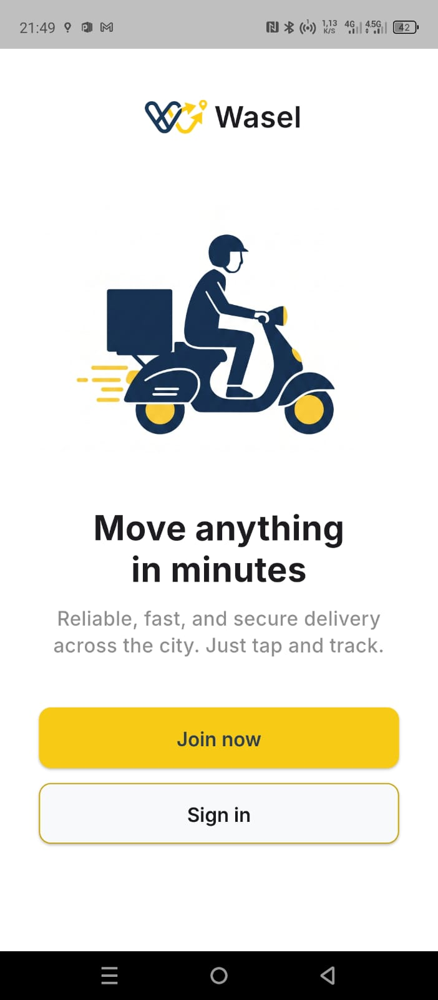 | 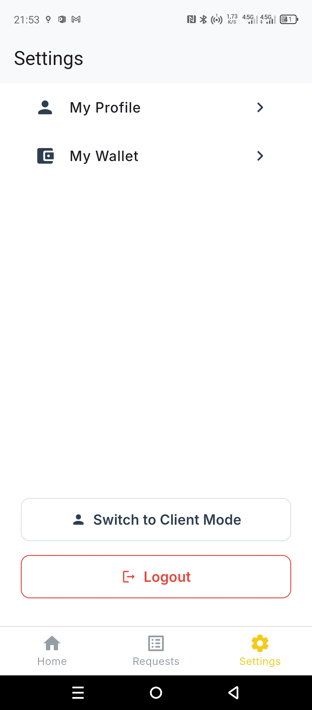 |

### Mode Client

| Créer une livraison | Mes demandes | Détail d'une livraison | Historique |
|:---:|:---:|:---:|:---:|
| 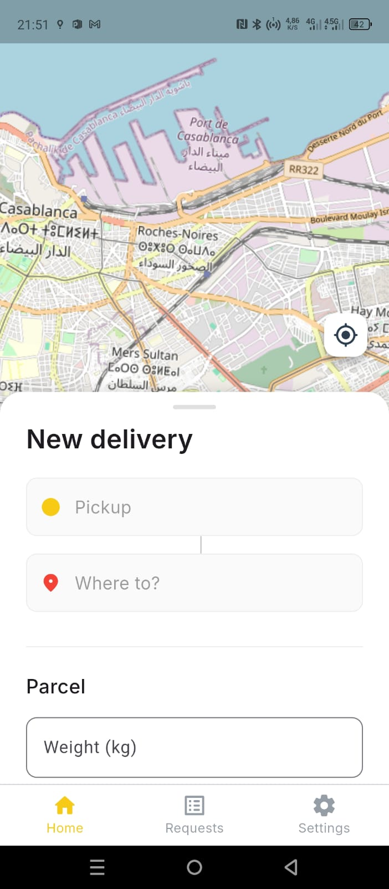 | 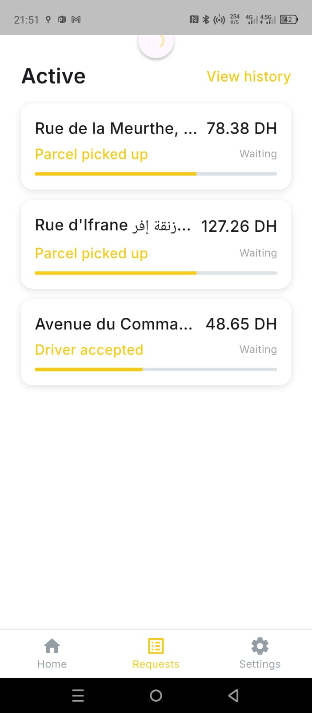 | 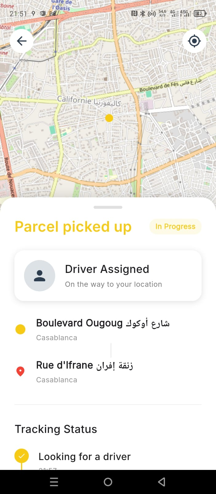 | 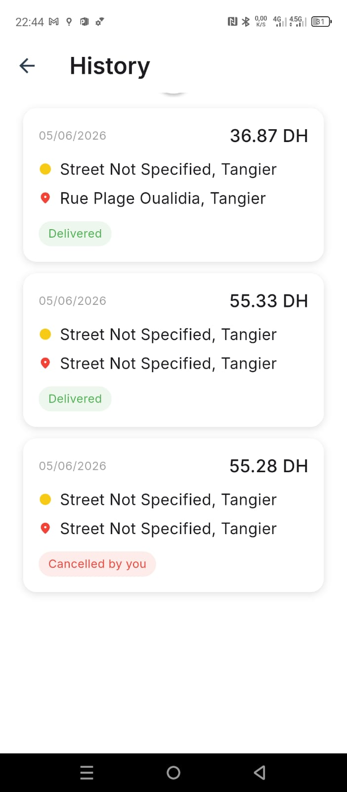 |

### Mode Livreur

| Missions disponibles | Mes courses | Détail d'une mission | Profil | Portefeuille |
|:---:|:---:|:---:|:---:|:---:|
| 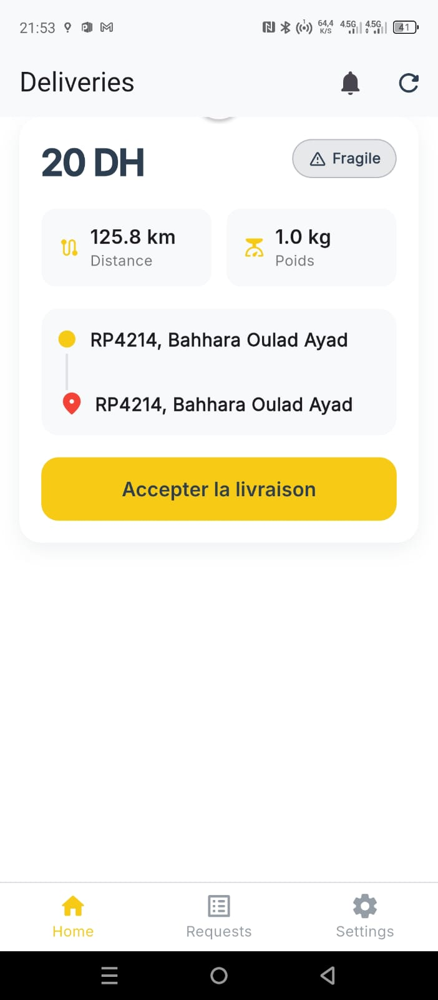 | 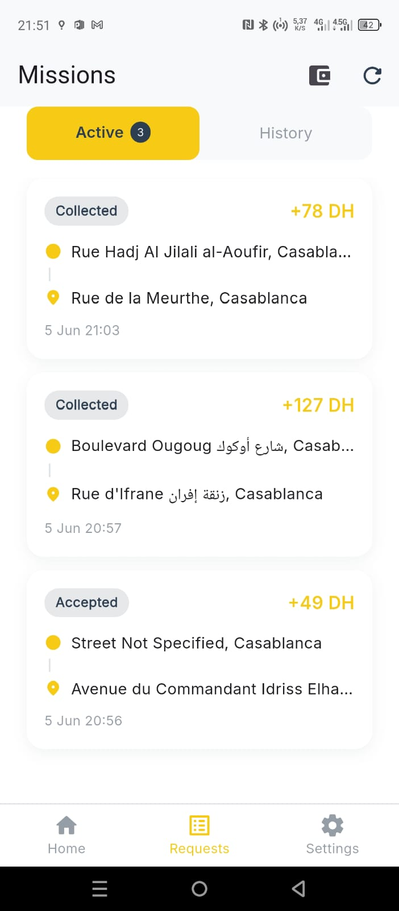 | 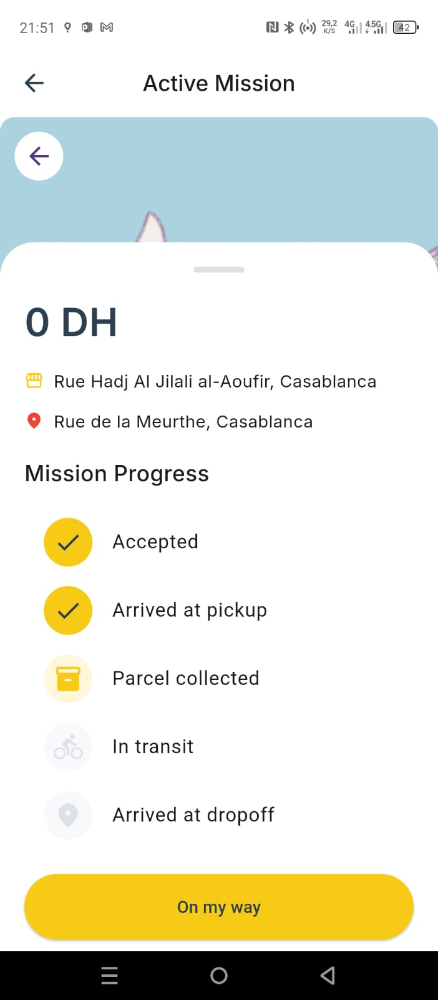 | 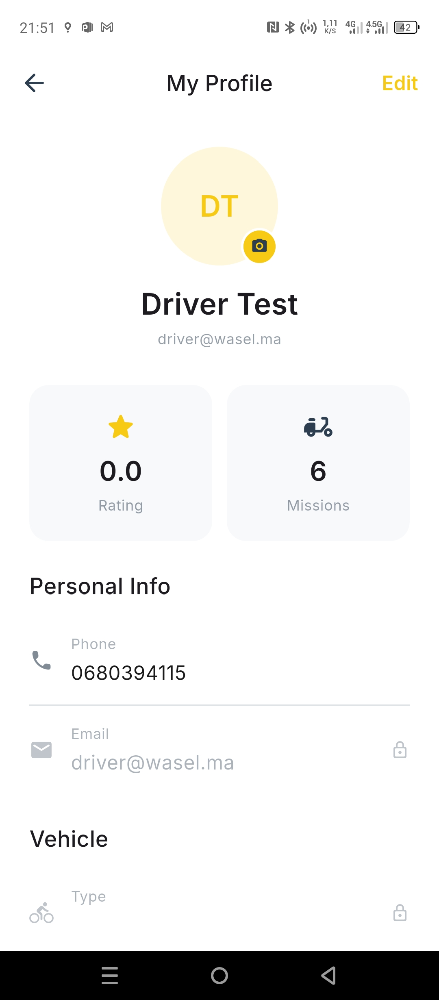 | 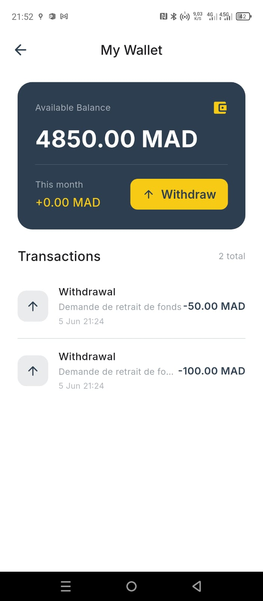 |

---

## 🚀 Fonctionnalités

### 👤 Mode Client
- **Créer une livraison** — Saisir les adresses de collecte et de dépôt, décrire le colis.
- **Suivi GPS en temps réel** — Visualiser la position du livreur sur une carte interactive (via `flutter_map` + `latlong2`), mise à jour par polling régulier de l'API.
- **Gestion & annulation** — Annuler une livraison en cours (selon son statut) et suivre l'évolution de chaque commande.
- **Historique** — Consulter l'ensemble des livraisons passées en détail.

### 🛵 Mode Livreur
- **Missions disponibles** — Parcourir les livraisons à proximité avec tous les détails, et les accepter ou refuser.
- **Gestion de mission active** — Progresser dans les statuts (En route → Collecté → Livré) via une timeline interactive.
- **Transmission GPS en direct** — Envoi régulier de la position au serveur pendant une mission active.

---

## 🛠 Stack Technique

| Couche | Technologie |
|---|---|
| Framework | Flutter 3.11.4+ / Dart |
| Cartes | `flutter_map` 8.3.0 + `latlong2` |
| Géolocalisation | `geolocator` 14.0.2 |
| Authentification | `flutter_appauth` 12.0.0 (OAuth2 + PKCE via Keycloak) |
| Stockage sécurisé | `flutter_secure_storage` 10.1.0 |
| HTTP | `http` 1.6.0 |
| Polices | `google_fonts` 8.1.0 |
| Splash / Icônes | `flutter_native_splash`, `flutter_launcher_icons` |

---

## 🏗 Architecture

L'application adopte une architecture **orientée fonctionnalité et séparée par rôle**, garantissant une isolation stricte entre la logique client et la logique livreur :

```
lib/
├── api/                        # Toute la communication HTTP/REST
│   ├── auth_service.dart       # OAuth2 + PKCE (Keycloak)
│   ├── delivery_service.dart
│   ├── driver_service.dart
│   ├── location_service.dart
│   ├── tracking_service.dart
│   └── user_service.dart
├── model/                      # Classes de données + désérialisation JSON
│   ├── available_delivery_model.dart
│   ├── driver_mission_model.dart
│   ├── driver_profile_model.dart
│   └── user_model.dart
├── screens/
│   ├── client/                 # Écrans réservés au Client
│   │   ├── home_screen.dart
│   │   ├── requests_screen.dart
│   │   ├── specific_request_screen.dart
│   │   └── history_screen.dart
│   ├── driver/                 # Écrans réservés au Livreur
│   │   ├── home_screen.dart
│   │   ├── requests_screen.dart
│   │   └── profile_screen.dart
│   ├── shared/
│   │   └── settings_screen.dart
│   ├── main_screen.dart        # Gestionnaire de rôle (IndexedStack)
│   ├── splash_screen.dart
│   └── welcome_screen.dart
├── themes/
│   ├── colors.dart
│   └── text_styles.dart
├── widgets/                    # Composants UI partagés
│   ├── driver/
│   ├── wasel_bottom_bar.dart
│   ├── wasel_logo.dart
│   └── wasel_logo_horizontal.dart
└── config.dart                 # URL de l'API + configuration d'environnement
```

---

## 📱 Test Rapide (sans compilation)

Un APK précompilé est disponible à la racine du dépôt.

**Lien Drive :** `app-release.apk`

**Compte de test (mode Livreur par défaut) :**
| Champ | Valeur |
|---|---|
| Email | `driver@wasel.ma` |
| Mot de passe | `driver123` |

> Une fois connecté, rendez-vous dans **Paramètres** pour basculer librement entre l'interface Client et l'interface Livreur.

---

## ⚙️ Installation & Lancement

### Prérequis

- Flutter SDK **3.11.4** ou version ultérieure
- Android Studio avec un émulateur configuré ou un appareil physique connecté
- Le backend Wasel est **déjà déployé** — aucune configuration serveur locale requise

### Étapes

**1. Cloner le dépôt**
```bash
git clone https://github.com/akramelassri/wasel-mobile.git
cd wasel-mobile
```

**2. Installer les dépendances**
```bash
flutter pub get
```

**3. Vérifier la configuration d'environnement**

Ouvrez `lib/config.dart` et vérifiez que l'URL de l'API et l'endpoint Keycloak pointent vers le bon environnement (staging par défaut).

Si vous testez sur un appareil Android physique avec un backend local, redirigez le port :
```bash
adb reverse tcp:5000 tcp:5000
```

**4. Activer la localisation**

> ⚠️ **Important :** Avant de lancer l'application, assurez-vous que la **localisation (GPS) est activée** sur votre appareil Android.
> - Allez dans **Paramètres → Localisation** et activez-la.
> - Lors du premier lancement, l'application demandera l'autorisation d'accéder à votre position — acceptez-la pour que le suivi et la transmission GPS fonctionnent correctement.

**5. Lancer l'application**
```bash
flutter run
```

---

## 👥 Auteurs

| Nom | Rôle |
|---|---|
| **Akram El Assri** | Développeur Flutter — Interface Client |
| **Nawar El Haouat** | Chef de projet & Développeur Flutter — Interface Livreur |